# 🔰JavaScriptをさわってみた

## 🔰JavaScriptとはなんぞや

そもそもJavaScriptって存在自体が入門者にはややこしい！

JAVAに名前が似てるし、調べだすとサーバサイドJavaScriptとか言う言葉も出てくるし。

というわけで、検索した結果をざっくりとまとめてみる。

- JAVAとJavaScriptは名前が似てるけど別物！
- JavaScriptは元々ブラウザ(Netscape)で動く言語として誕生。
- IEにもJScriptとか言うJavaScriptに似た言語が搭載。
- ブラウザ間で混沌としてきたのでECMA（標準化団体）に標準化が託されてECMAScriptという仕様が出てくる。
- ちなみにECMAScriptの実装としては下記のようなJavaScriptエンジンが登場している。
  - [Rhino](https://developer.mozilla.org/ja/docs/Rhino)
  - [SpiderMonkey](https://developer.mozilla.org/ja/docs/SpiderMonkey)
  - [google v8エンジン](https://github.com/v8/v8/wiki)
  - etcetc
- いつの時代からかブラウザのクライアント処理だけでなく、ブラウザ外の処理もJavaScriptで実装したい -> JavaScriptの標準仕様だと機能が足りないので独自拡張されたランタイムが勃興。
- これは元々ブラウザ用の言語だったので標準標準入出力やモジュール機能やファイルI/Oやら普通の言語なら持っている物が色々と存在しなかった。
- 色々とランタイムが勃興してきて混沌としてきたので、サーバサイドの処理について標準的な仕様を作ろうとServerJSプロジェクト(任意団体)が立ち上がる。(2009年1月)
- ServerJSがサーバサイドだけじゃなくて、より広範囲を対象とするためにCommonJSに改名する。(2009年8月)
- CommonJSの実装としてNode.jsとか出てきて流行るけれど、Node.jsはすでにCommon.JSを独自拡張をして独自ルートを走っている。さらにその独自仕様に対して他も追従して事実上の標準みたいな形になっているらしい。
- ちなみにNode.jsはgoogle v8エンジンで動作している。
- ECMAScript6から正式なナンバリングがES2015のような策定した年表記になり毎年新しい規格が策定されるようになる。

調べはじめると歴史的な経緯が色々と出てきて、それだけでしんどい。

ネットを漁ると古い情報もザクザクと出てくるので、なるたけ最新の情報を取捨選択して色々と試して行きたい所。

また全てを把握して各種ブラウザに対応するコーディングをしていくのはとても大変。人間技ではない。

そこら辺は各種パッケージを駆使して、人間がなるたけ快適にやっていくのが良さそう。

exsample

- JavaScriptのlinter(構文チェックしてくれる)としてESLintというパケージがNode.jsにあるので利用する。
- ECMAScriptの最新の規約でコーディングして、各種ブラウザで動作する形にBabelというパッケージを利用して変換する。
- とかとか

だがWeb界隈は流れが速いのでパッケージも新しいのがたくさん出て来るし、アレが流行ったりコレが廃れたり……何使えばいいか迷う！

個人的には取っ掛かりが多すぎてものすごく捉えづらい。

というわけで本資料ではブラウザ(chrome)とエディタ(VScode)を使って基本的な所だけ説明します。

## 🔰参考になるドキュメンド

- [MDN JavaScript](https://developer.mozilla.org/ja/docs/Web/JavaScript)

MDN(Mozilla Developer Network)のJavaScriptドキュメントが綺麗にまとまってて見やすい。

## 🔰ブラウザ(chrome)の開発者ツールを利用してJavaScriptを実行

とりえあずJavaScriptを動かしてみる環境としてブラウザの開発者ツールを利用してみる。

ここでは例としてchromeを利用していますが。

IE/Firefox/Edgeでも同じようなコンソールが用意されています。

chromを起動して**F12キー** or **Ctrl+Shift+I**で下記のような画面が起動します。

コンソールタブを選択すると下記のような画面が表示されます。

▶コンソール画面  
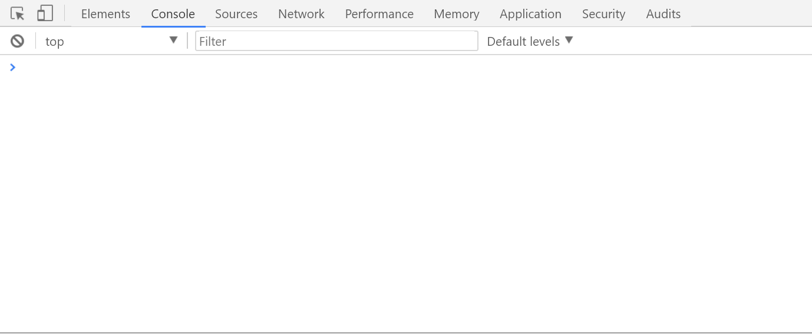

ここに下記のように入力して**Enter**を押すと

```JavaScript
//console.logでコンソールにメッセージを表示
console.log('hello world')
```

▶実行結果  
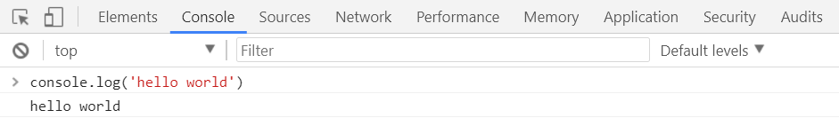

上記のような感じでconsoleに**hello world**と表示されます。

なお入力時に**shift+Enter**で改行ができ、下記のように複数行入力も出来たりします。

▶入力  
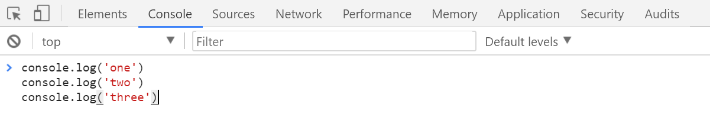

▶実行結果  
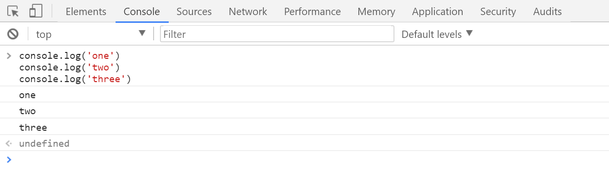

このコンソールでJavaScriptの基本的な動作を実行して確認していきます。

### 💎大文字小文字は区別

JavaScriptでは大文字と小文字は別物だと認識されます。

```JavaScript
//大文字小文字の違いにより、それぞれ別の変数として扱われる
var sensitive = 'sensitive';
var Sensitive = 'Sensitive';
var SENSITIVE = 'SENSITIVE';

console.log(sensitive);
console.log(Sensitive);
console.log(SENSITIVE);
```

▶実行結果  


### 💎コメント

JavaScriptでソースにコメントを記載するには

- 一行コメントの場合は **//**
- 複数行コメントの場合は **/*** ~~ ***/**

上記の用にすればよい。

```JavaScript
// 一行

/* 複数行
hogehoge
*/
```

### 💎行末はセミコロン

JavaScriptでは行末は下記のようにセミコロンで記述します。

```JavaScript
//helloWorld
console.log('HelloWorld');
```

セミコロンを書き忘れてもASI(Automatic Semicolon Insertion)という仕組みで保管されたりするのですが。
ASIの仕組みを熟知していないと意図しない所で保管される可能性もあるので、個人的にはセミコロンを明示的に書きたい所。

ただどうしても書き忘れが出てくるので。
JavaScript用のlinter(プログラムの構文チェックをやってくれる)を何かしら使いたい。

Node.jsにESLintというJavaScriptのコードをルールに従ってチェックしてくれるパッケージがあるのでそこらへんを使うと便利です。

### 💎変数定義

変数定義に使うコマンドは

- var
- let(ES2015で追加)
- const(ES2015で追加)

元々は変数定義はvarしかなかったようですが、ES2015でletとconstが追加されたようです。
それぞれ。

- var と let は変数を定義するがスコープが違う
- varはfunction scope
- letはblock scope
- letは重複定義しようとするとhas already been declaredでエラーになります。
- constは読み取り専用の定数を宣言し、再代入しようとするとエラーになります。

```JavaScript
var keyWord = 'hello world';
let food = 'banana';
const keyPhrase = 'Abracadabra';

console.log(keyWord);
console.log(food);
console.log(keyPhrase);
```

▶実行結果  
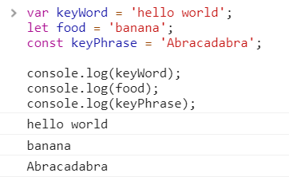

varとletのスコープ周りの話は後述します。

letの対応状況がイマイチだった昔ならばいざしらず。
今現在は基本的にはletを使い。真に必要な場合にvarを使うのが良さそうです。

### 💎変数の巻き上げ（ホイスティング）

[MDN 変数の巻き上げ](https://developer.mozilla.org/ja/docs/Web/JavaScript/Guide/Grammar_and_types#Variable_hoisting)

JavaScriptだと下記のようなコードもエラー無く実行される。

```JavaScript
console.log(variable);
var variable = 'helloWorld';
console.log(variable);
```

▶実行結果  
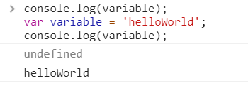

変数**variable**をvarで宣言するまえに、console.logでアクセスしているのでエラーとなりそうなものですが。
ホイスティングの機能で下記のコードと等価として扱われてエラーとなりません。

```JavaScript
var variable;
console.log(variable);
variable = 'helloWorld';
console.log(variable);
```

なお、letを用いた場合は宣言前に変数にアクセスするとエラーとなります。  
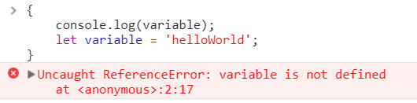

### 💎文字列を扱う

JavaScriptでは**'(シングルコーテーション)**と**"ダブルコーテション**での何れかで括ると文字列リテラルだと認識されます。

```JavaScript
//変数left と rightを定義してそれぞれに文字列を代入
var left = 'hello';
var right = 'world';
//２つの変数を+でconcatenate
var concatenate = left + right;
//コンソールログで表示
console.log(concatenate);
```

▶実行結果  
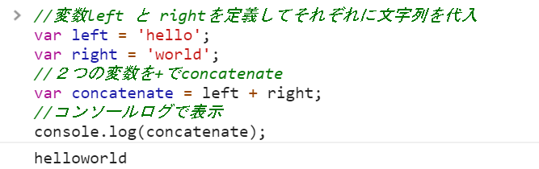

### 💎文字列長を取得

文字列リテラルのlengthプロパティには文字列長が格納されています。

```JavaScript
//変数languageを定義して文字列を代入
var language = 'JavaScript';

//変数の後ろに.lengthのようにlengthプロパティを指定すると文字列長が取得できる
console.log(language.length);
```

▶実行結果  
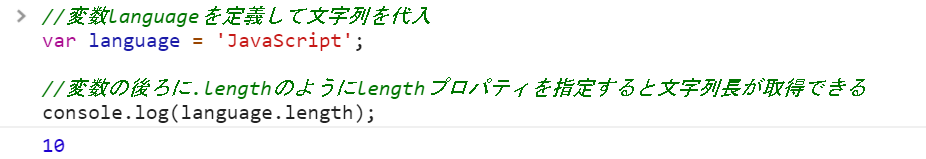

### 💎数値を扱う

```JavaScript
//+で足し合わせる
var sum = 10 + 20;
//コンソールログで表示
console.log(sum);
```

▶実行結果  
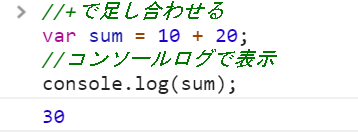

### 💎数値と数字（文字列）を相互に変換

#### 数値を数字（文字列）に変換

toStringメソッドを用いてオブジェクトを文字列に変換する。

```JavaScript
//変数num1 と num2を定義してそれぞれに数値を代入
var number1 = 10;
var number2 = 20;

//数値のまま +
var sumNumber = number1 + number2;
//tostringで変数を文字列に変換して +
var concatenateNumber = number1.toString() + number2.toString();
//コンソールログで表示
console.log(sumNumber);
console.log(concatenateNumber);
```

▶実行結果  
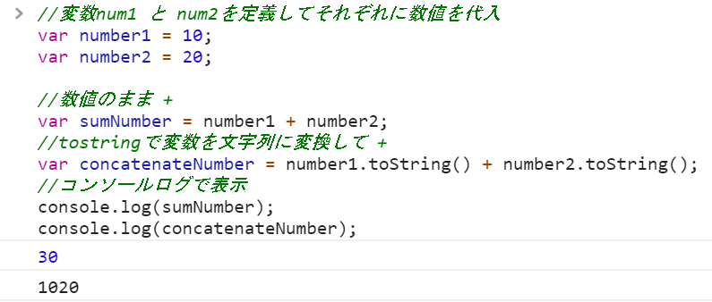

#### 数字（文字列）を数値に変換

parseInt関数を用いて、文字列を数値に変換する。

```JavaScript
//変数num1 と num2を定義してそれぞれに数値を代入
var stringNumber1 = '10';
var stringNumber2 = '20';

//文字列のまま +
var concatenateNumber = stringNumber1 + stringNumber2;
//tostringで変数を文字列に変換して +
var sumNumber = parseInt(stringNumber1) + parseInt(stringNumber2);
//コンソールログで表示
console.log(sumNumber);
console.log(concatenateNumber);
```

▶実行結果  
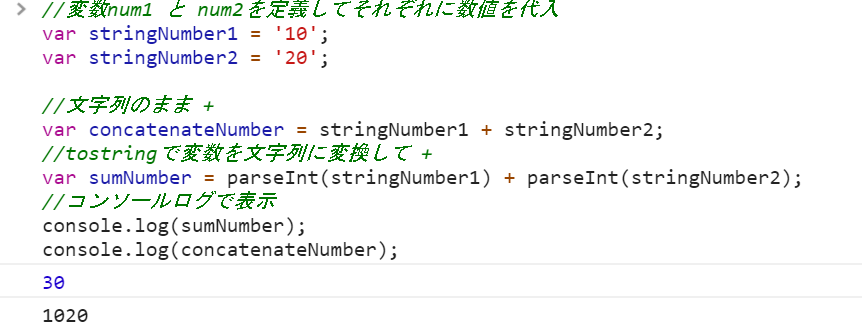

### 💎ブロック文

ブロック文は`{}`で括ることにより命令のグループ化を行えます。
if文とかfor文とかwhile文とかで使われる{}もこのブロック文です。

```JavaScript
{
    console.log('good morning');
    console.log('hello');
    console.log('good night');
}
```

▶実行結果  
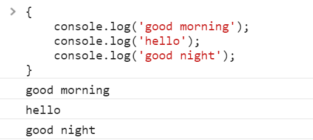

### 💎ブロック文のスコープ

変数宣言で出てきたletはブロックをスコープとした変数の宣言です。
ES2015以前はブロックスコープが存在しなかったのでvarだと下記のようにブロックがあろうがなかろうがお構いない感じでした。

```JavaScript
//ブロック外で変数scopeを宣言
var varScope = 'outBlock';
{
    //ブロック内でブロック外の変数scopeにアクセスできる
    varScope = 'innerBlock';
}
//innerBlockが表示される
console.log(varScope);
```

▶実行結果  
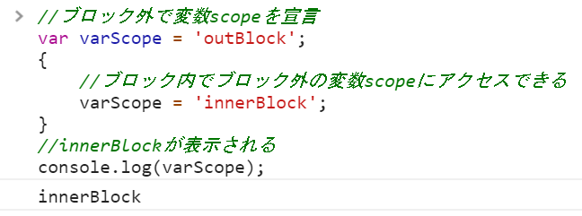

letを使うと下記のような感じになります。

```JavaScript
{
    //変数letScopeを宣言
    let letScope = 'outBlock';
    {
    //一番内側のブロックで変数letScopeを宣言
        let letScope = 'innerBlock';
    }
    //outBlockが表示される
    console.log(letScope);

}
```

▶実行結果  
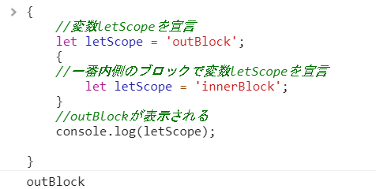

こういう動作を見ると、やはり基本的にはletを使っていくのがベターなんだと感じます。

### 💎関数定義

下記の例では関数 **drinkLiquor**を定義しています。
引数として**Liquor**を渡して、**return**で文字列を返しています。

```JavaScript
function drinkLiquor(liquor) {
    return 'This ' + liquor + ' is delicious.';
}

console.log(drinkLiquor('sake'));
console.log(drinkLiquor('whisky'));
```

▶実行結果  
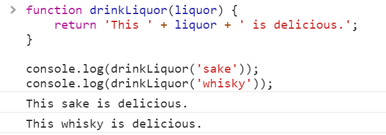

### 💎関数式(FunctionExpression)

functionは下記のように式にもできる。

```JavaScript
{
    let drinkFE = function drinkLiquor(liquor) {
        return 'This ' + liquor + ' is delicious.';
    };

    console.log(drinkFE('sake'));
}
```

▶実行結果  


### 💎無名関数(AnonymousFunction)

関数式の場合、関数名は下記のように無名にもできる。

```JavaScript
{
    let drinkAF = function (liquor) {
        return 'This ' + liquor + ' is delicious.';
    };

    console.log(drinkAF('sake'));
}
```

▶実行結果  
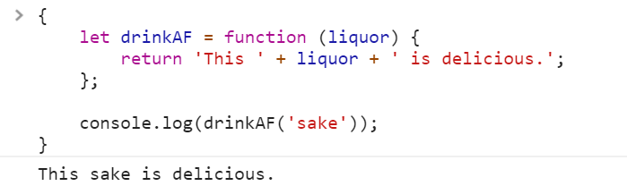

### 💎即時関数（IIFE: Immediately Invokable Function Expressions)

関数式は一度だけ使う場合、下記のように記述すれば関数の定義と実行をいっぺんに行えます。
`関数式を()でくくって、その後に(引数)`と続ける

`(関数式)(引数)`

```JavaScript
{
    let drinkString = (function (liquor) {
        return 'This ' + liquor + ' is delicious.';
    })('sake');

    console.log(drinkString);
}
```

▶実行結果  
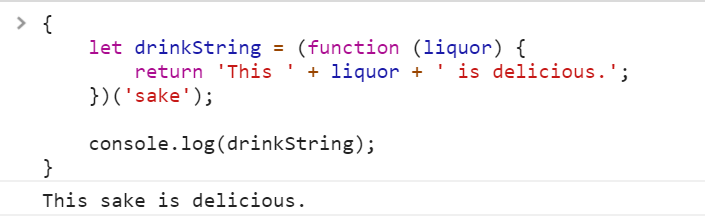

### 💎関数のスコープ

varはfunction scopeなので、ブロック文の時とは異なりfunctionでは下記のように動作します。

```JavaScript
//変数varScopeを宣言
var varScope = 'outFunction';

(function testScope(){
    //function外で宣言した変数とは別のスコープとしてvarScopeが宣言される
    var varScope = 'innerFunction';
})();

//outFunctionが表示される
console.log(varScope);
```

▶実行結果  
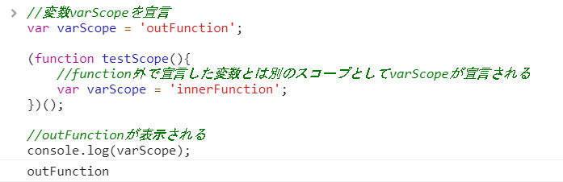

### 💎if文

if文は下記のように記述する。

```JavaScript
{
    let isEnable = true;

    if (isEnable) {
        //条件が真の場合
        console.log('設定は有効です');
    } else {
        //条件が偽の場合
        console.log('設定は無効です');
    }
}
```

上記の例だとisEnableの部分が論理条件で、この論理条件によって真の場合と偽の場合に処理が分岐する。

▶実行結果  
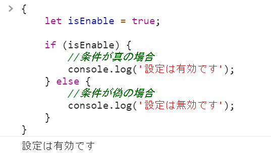

### 💎for文

forループを行うには

> for(初期処理;論理条件;インクリメント処理){ ステートメント }

```JavaScript
{
    let total = 0;
    const limit = 10;
    //forでループ
    for (let index = 0; index < limit; index++) {
        total += index;
    }
    //cosole.logで表示
    console.log(total);  
}
```

▶実行結果  
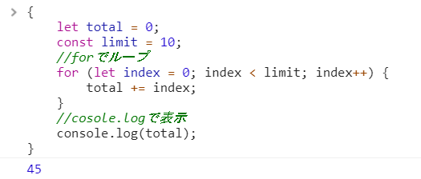

### 💎配列を扱う

```JavaScript
{
    let sake = ['普通酒', '純米', '特別純米', '本醸造', '特別本醸造', '吟醸', '大吟醸', '純米吟醸', '純米大吟醸'];
    console.log(sake);

    //配列に順次アクセス その1
    for ( let index = 0; index < sake.length; index++) {
        console.log(sake[index]);
    }

    //配列に順次アクセス その2
    for ( let index in sake) {
        console.log(sake[index]);
    }

    //配列に順次アクセス その3
    for (let value of sake) {
        console.log(value);
    }

}
```

▶実行結果  
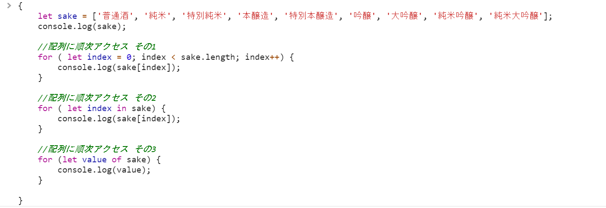

▶実行結果  
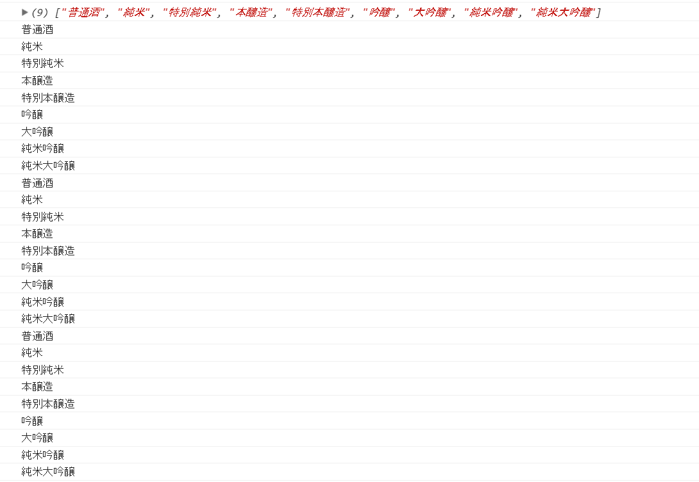

### 💎オブジェクトを定義

**new Object()** を利用してオブジェクトの定義が行なえます。
下記ではオブジェクトを定義した後に、プロパティを登録しています。

```JavaScript
{
    //new Object()でプロパティを持たないオブジェクトを定義
    let funaguchiKikusui = new Object();

    //定義したオブジェクトにプロパティを定義していく
    funaguchiKikusui.SakeType = 'Honjozo';
    funaguchiKikusui.AlcoholContents = '19%';
    funaguchiKikusui.MillingRate = '70%';
    funaguchiKikusui.VOLUME = '200ml';
    funaguchiKikusui.ServingSuggestion = ['On the Rocks', 'Chilled'];
}
```

▶実行結果  
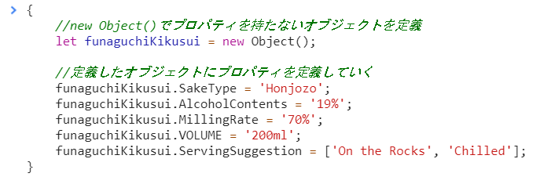

その2

new Object()ではなく{}でもプロパティを持たないオブジェクトを定義できる。

```JavaScript
{
//{}でプロパティを持たないオブジェクトを定義
    let funaguchiKikusui = {};

    //定義したオブジェクトにプロパティを定義していく
    funaguchiKikusui.SakeType = 'Honjozo';
    funaguchiKikusui.AlcoholContents = '19%';
    funaguchiKikusui.MillingRate = '70%';
    funaguchiKikusui.VOLUME = '200ml';
    funaguchiKikusui.ServingSuggestion = ['On the Rocks', 'Chilled'];
}
```

▶実行結果  
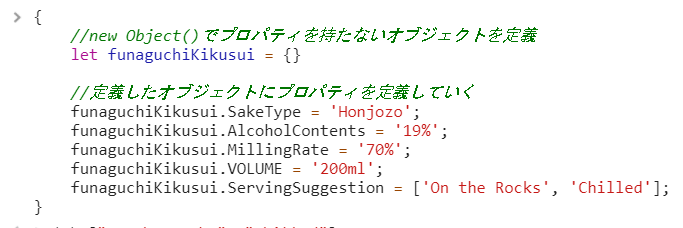

その3

初期化で下記のように定義もできる。

```JavaScript
{
    let funaguchiKikusui = {
        SakeType : 'Honjozo',
        AlcoholContents : '19%',
        MillingRate : '70%',
        VOLUME : '200ml',
        ServingSuggestion: ['On the Rocks', 'Chilled']
    };
}
```

▶実行結果  
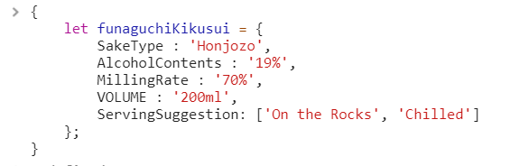

### 💎プロパティへアクセス

オブジェクトのプロパティへアクセスするには

> オブジェクト.プロパティ

のようにすればよい。

```JavaScript
{
    let funaguchiKikusui = {
        SakeType: 'Honjozo',
        AlcoholContents: '19%',
        MillingRate: '70%',
        VOLUME: '200ml',
        ServingSuggestion: ['On the Rocks', 'Chilled']
    };

    //プロパティへのアクセス その1
    console.log(funaguchiKikusui.SakeType);
    console.log(funaguchiKikusui.ServingSuggestion[0]);
    console.log(funaguchiKikusui.ServingSuggestion[1]);

    //プロパティへのアクセス その2(ブラケット表記法)
    console.log(funaguchiKikusui['SakeType']);
    console.log(funaguchiKikusui['ServingSuggestion'][0]);
    console.log(funaguchiKikusui['ServingSuggestion'][1]);
}
```

▶実行結果  
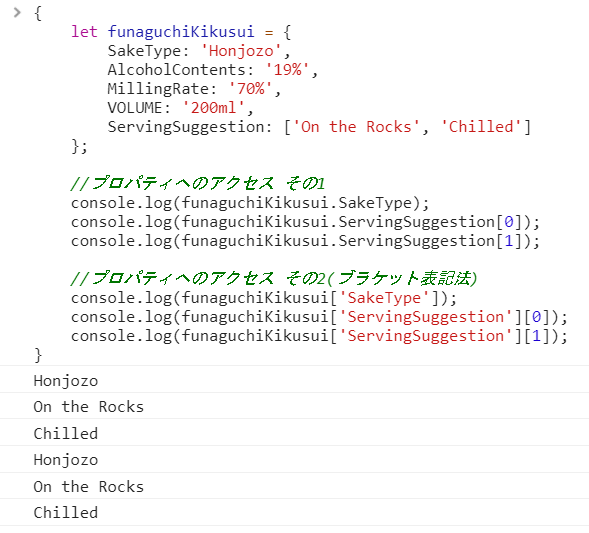

### 💎全プロパティの列挙

ECMAScript5から

- for...in ループ
- Object.keys(o)
- Object.getOwnPropertyNames(o)

の3つを使ってプロパティを列挙できる。

```JavaScript
{
    let funaguchiKikusui = {
        SakeType: 'Honjozo',
        AlcoholContents: '19%',
        MillingRate: '70%',
        VOLUME: '200ml',
        ServingSuggestion: ['On the Rocks', 'Chilled']
    };

    // for inを使ったケース
    console.log('===for-in===');
    for (let sakeProperty in funaguchiKikusui) {
        console.log(sakeProperty);
    }

    //Object.keysを使ったケース
    //Object.keysでプロパティのkeyを取得して各プロパティにアクセス
    console.log('===Object.keys===');
    let objKeys = Object.keys(funaguchiKikusui);

    console.log(objKeys);

    //Object.getOwnPropertyNamesを使ったケース
    console.log('===Object.getOwnPropertyNames===');
    let PropertyNames = Object.getOwnPropertyNames(funaguchiKikusui);

    console.log(PropertyNames);
}
```

### 💎プロパティの削除

**delete**演算子をつかってプロパティを削除できる

```JavaScript
{
    let funaguchiKikusui = {
        SakeType: 'Honjozo',
        AlcoholContents: '19%',
        MillingRate: '70%',
        VOLUME: '200ml',
        ServingSuggestion: ['On the Rocks', 'Chilled']
    };

    delete funaguchiKikusui.ServingSuggestion;
}
```

▶実行結果  
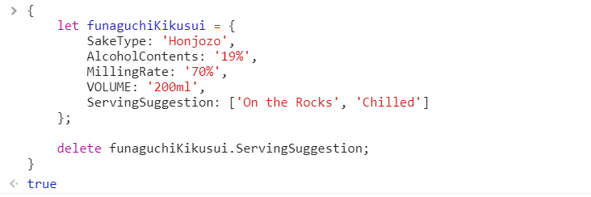

## 🔰html+JavaScriptで実行してみる(VSCode+Chrome)

ブラウザの開発者ツールで動作を色々と確かめたので。
html+JavaScriptで試しに動かしてみる。

html中にJavascriptを記述するには`<scrip>`タグを利用すればよい。

一例としては下記のような感じ。

```html
<!DOCTYPE html>
<html lang="ja">
<head>
    <title>JavaScriptSample</title>
    <script >
        console.log('helloWorld');
    </script>
</head>
<body>
</body>
</html>
```

このhtmlをファイル保存してchromeで開くと、consoleに下記のように表示されるかと思います。  
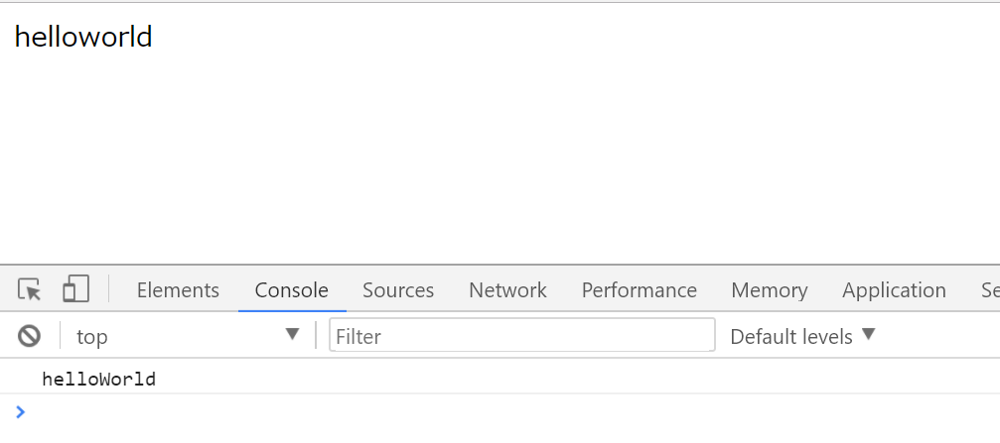

今回はhtmlファイルにJavaScriptを記載してますが。

```html
<script srt="./script.js"></script>
```

のような形で外部のjsファイルから読み込むこと事も出来ます。

### 💎VSCodeの設定

VSCodeのデバック実行からchromeを起動してhtmlをデバックする設定。

#### 今回利用する拡張機能

- [HTML Snippets](https://marketplace.visualstudio.com/items?itemName=abusaidm.html-snippets)
- [Debugger for Chrome](https://marketplace.visualstudio.com/items?itemName=msjsdiag.debugger-for-chrome)

HTML Snippetsは文字通りHTMLのスニペット。今回はあまり関係ないがHTMLを書く時にインストールしていれば便利。

Debugger for ChromeはVSCodeとChromeを連携させてデバック出来るようにする拡張。  


利用すると上記のようにVSCodeからchromeを起動してVSCodeのデバックコンソールに結果が表示されるようになる。
上記例だとVSCodeのデバックコンソールにconsole.logが表示されてる事が確認できる。

VSCodeでコードを書きながら逐次確認できるので便利かと思いますが、普通にchromeを起動してchromeの開発者コンソールでも良いかと思います。

#### Debugger for Chromeの設定

先に説明した拡張機能をVSCodeにインストールした後に。

デバック->構成の追加  
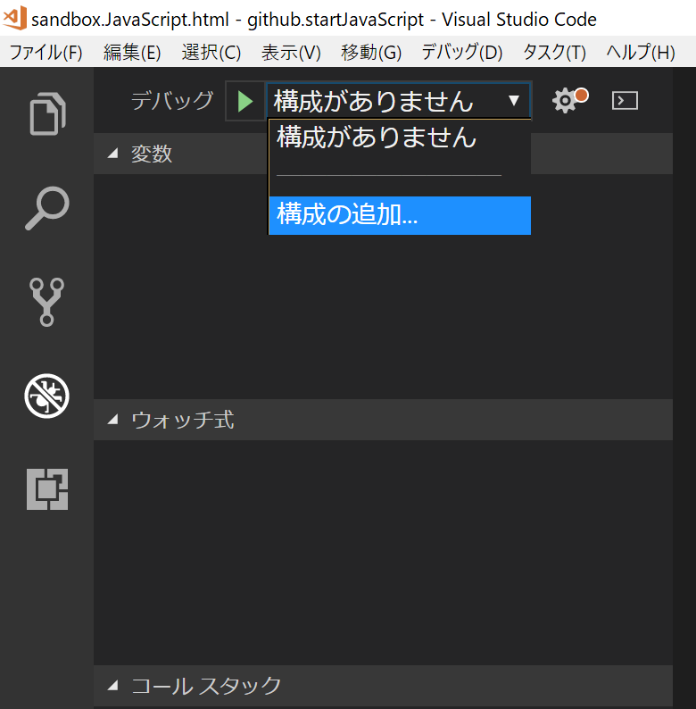

Chromeを選択  
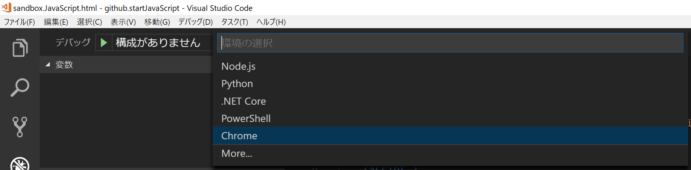

VSCodeのデバック設定に用いるlaunch.jsonがworkspaceの.vscodeに作成される。  
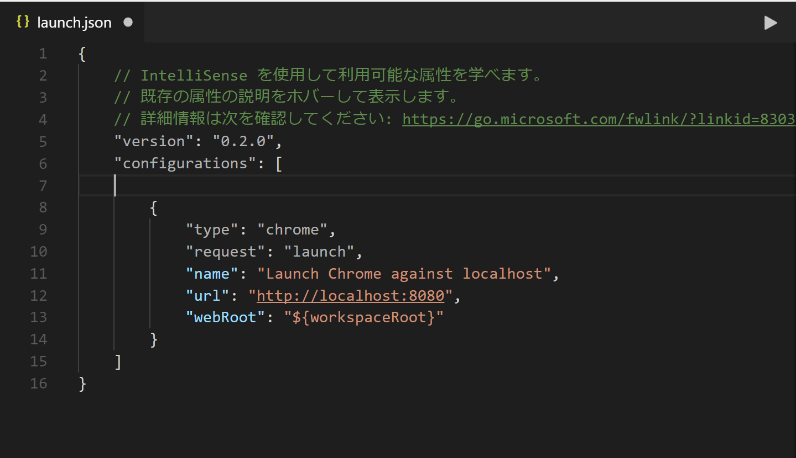

今回は現在開いているファイルをchromeにlaunchしてデバックしたいので下記のように設定を記載します。

このlaunch.jsonの書き方については下記に資料があります。  
[VSCODEデバック](https://vscode-doc-jp.github.io/docs/userguide/debugging.html)

launch.jsonファイルを編集  


今回のデバックで利用する設定の名称をJavaScript検証と設定したので、コレを選択してデバック実行(F5)。  
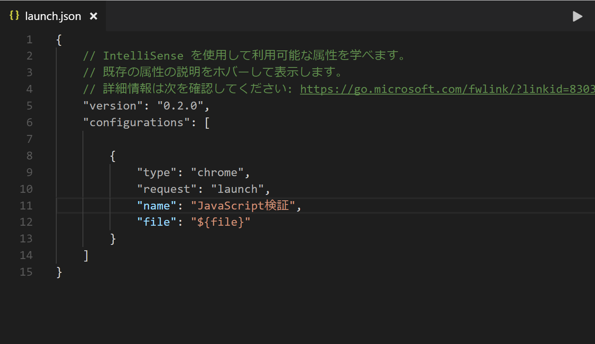

デバック実行されました。  
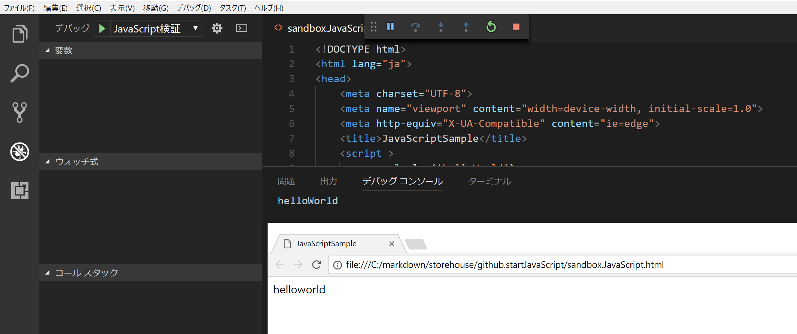

### 💎DOM (Document Object Model) でHTMLを操作

- [Document Object Model](https://ja.wikipedia.org/wiki/Document_Object_Model)

DOMはHTMLをアプリから取り扱う為のAPIですが、これをJavaScriptから利用してみます。

今回は下記のようなhtml+JavaScriptを利用します。

```html
<!DOCTYPE html>
<html lang="ja">

<head>
    <title>tutorial.dom</title>
    <script src="./script.dom.js" async></script>
</head>

<body>
    <div id="language"></div>
    <div id="greet"></div>

    <button onclick="getTitle();">タイトル取得</button>
    <button onclick="setGreetEN();">English</button>
    <button onclick="setGreetJA();">日本語</button>

</body>

</html>
```

script.dom.jsファイル

```JavaScript
//タイトルの取得
function getTitle() {
    let title = document.title;
    console.log(title);
}

//日本語挨拶をセット
function setGreetJA() {
    var greet = document.getElementById('greet');
    var language = document.getElementById('language');
    language.innerText = '日本語';
    greet.innerText = 'こんにちは';
}

//英語挨拶をセット
function setGreetEN() {
    var greet = document.getElementById('greet');
    var language = document.getElementById('language');
    language.innerText = 'English';
    greet.innerText = 'Hello';
}
```

今回やっていること

- script要素のsrc属性を利用してい外部jsファイルの読み込み
- button要素のonclick属性を利用して外部jsのfunctionを実行
- DOMのtitleプロパティを利用してタイトルを取得してコンソールに書込み
- DOMのgetElementByIdを利用してdiv要素に情報書込み

- script.dom.js
- tutorial.dom.html

上記のファイルを作成して  
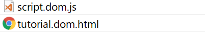

tutorial.dom.htmlを実行  
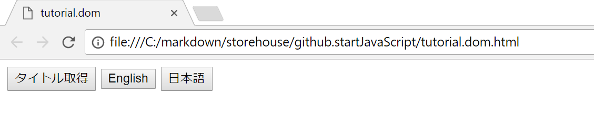

タイトル取得ボタンを押すとコンソールログにtitleが表示される。  
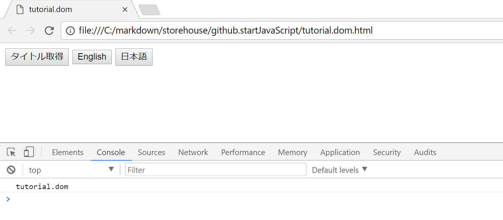

Englishボタンを押すと、div要素に値を書き込む  
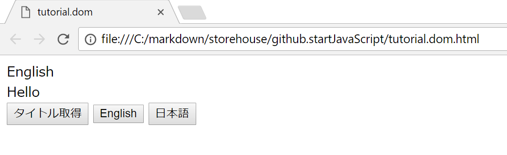

日本語ボタンを押すと、div要素に値を書き込む  
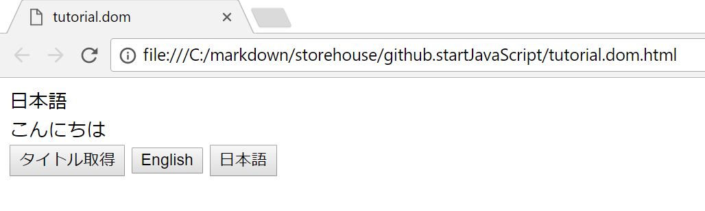

## 🔰総評

JavaScriptって実装が先にあり、混沌としてから標準化が始まったり。  
また前提となるブラウザの覇権争い。各ブラウザでの互換。バージョン互換。  
調べ始めたら混沌とした状態が長らく続いているという感じで、とても辛そうに感じたのですが。  
以外としぶとく生き延びで、段々と勢力を増してるのをみて。なんかすごい！　って感じ。  